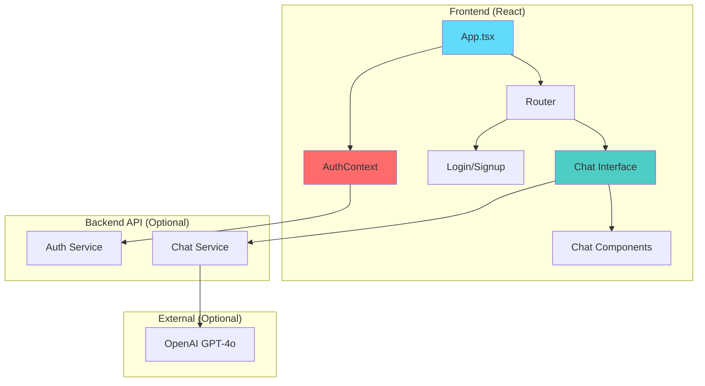

# TryIt - AI Chatbot with JWT Authentication

A modern React-based AI chatbot application with secure JWT token authentication and real-time chat capabilities. **Works with or without API configuration!**

## 🚀 Quick Start

### Prerequisites
- **Node.js** (v16+)
- **npm** or **yarn**
- **Backend API** with JWT authentication (optional)

### Setup
```bash
# Clone & install
git clone <repository-url>
cd tryitweb-main
npm install

# Environment setup (OPTIONAL - app works in demo mode without API)
# Create .env file for real API:
REACT_APP_API_LINK=https://openrouter.ai/api/v1
REACT_APP_API_KEY=your_openrouter_api_key_here
REACT_APP_MODEL=openai/gpt-3.5-turbo
REACT_APP_MAX_TOKENS=1000
REACT_APP_TEMPERATURE=0.7

# Start development
npm start
```

### Available Scripts
| Command | Description |
|---------|-------------|
| `npm start` | Development server |
| `npm test` | Run tests |
| `npm run build` | Production build |

## 🎯 **Demo Mode vs Real API Mode**

### **Demo Mode (No API Required)**
- ✅ **Mock Authentication**: Sign up and log in with any credentials
- ✅ **Demo Chat**: Send messages and get mock AI responses
- ✅ **Full UI Experience**: All features work without backend
- ✅ **Local Storage**: User data persists in browser
- ✅ **Perfect for Testing**: Works immediately after clone

### **Real API Mode (With API Configuration)**
- ✅ **Real Authentication**: Connect to your backend API
- ✅ **AI Chat**: Real AI responses from OpenAI/GPT
- ✅ **Production Ready**: Full functionality with backend
- ✅ **Secure**: JWT tokens and proper authentication

## 🤖 **OpenRouter Integration (Recommended)**

OpenRouter provides free access to multiple AI models. Here's how to set it up:

### **Step 1: Get OpenRouter API Key**
1. Sign up at [openrouter.ai](https://openrouter.ai)
2. Get your free API key (10,000 requests/month)
3. No credit card required

### **Step 2: Configure Environment Variables**
```
REACT_APP_API_LINK=https://openrouter.ai/api/v1
REACT_APP_API_KEY=your_openrouter_api_key_here
REACT_APP_MODEL=openai/gpt-3.5-turbo
REACT_APP_MAX_TOKENS=1000
REACT_APP_TEMPERATURE=0.7
```

### **Step 3: Available Models**
```
# OpenAI Models
openai/gpt-3.5-turbo (recommended for free tier)
openai/gpt-4
openai/gpt-4-turbo

# Anthropic Models
anthropic/claude-3-haiku
anthropic/claude-3-sonnet

# Google Models
google/gemini-pro
google/gemini-flash-1.5

# Meta Models
meta-llama/llama-3.1-8b-instruct
meta-llama/llama-3.1-70b-instruct
```

### **Step 4: Deploy with OpenRouter**
1. Set the environment variables in Vercel
2. Deploy your app
3. Chat will use real AI responses from OpenRouter

## 🚀 Deployment to Vercel

### **Option 1: Deploy in Demo Mode (Easiest)**
1. **Push your code to GitHub**
2. **Connect to Vercel:**
   - Go to [vercel.com](https://vercel.com)
   - Sign up/Login with GitHub
   - Click "New Project"
   - Import your repository
   - Vercel will auto-detect it's a React app

3. **Deploy:**
   - Click "Deploy"
   - **No environment variables needed!**
   - App works immediately in demo mode

### **Option 2: Deploy with Real API**

1. **Set Environment Variables in Vercel:**
   - Go to your Vercel project settings
   - Navigate to "Environment Variables"
   - Add the following variables:
   ```
   REACT_APP_API_LINK=https://your-api-domain.com/api
   REACT_APP_API_KEY=your_production_api_key
   REACT_APP_MODEL=gpt-4o
   REACT_APP_MAX_TOKENS=1000
   REACT_APP_TEMPERATURE=0.7
   ```

2. **Deploy:**
   - Click "Deploy"
   - App will use real API for authentication and chat

### **Demo Mode Features**

When no API is configured, the app provides:

- **Welcome Message**: Explains demo mode to users
- **Mock Authentication**: 
  - Sign up with any email/password
  - Login with created credentials
  - Data stored in browser localStorage
- **Demo Chat Responses**: 
  - Realistic mock AI responses
  - Explains that it's demo mode
  - Simulates API delays for realism
- **Full UI Experience**: 
  - All components work normally
  - No broken features or errors

### **API Endpoints Required (for Real Mode)**

Your backend API must provide these endpoints:

| Endpoint | Method | Description |
|----------|--------|-------------|
| `/auth/signup` | POST | User registration |
| `/auth/login` | POST | User login |
| `/chat` | POST | Send messages to AI |

### **Example API Responses**

**Login Response:**
```json
{
  "token": "jwt_token_here",
  "user": {
    "id": "user_id",
    "name": "John Doe",
    "email": "john@example.com"
  }
}
```

**Chat Response:**
```json
{
  "choices": [
    {
      "message": {
        "content": "AI response here"
      }
    }
  ]
}
```

## 🔧 Troubleshooting

### **Demo Mode Issues**
- **Authentication not working**: Check browser console for errors
- **Chat not responding**: Ensure you're logged in
- **Data not persisting**: Check if localStorage is enabled

### **Real API Mode Issues**
- **Authentication not working**: Verify environment variables and API accessibility
- **Chat not working**: Check API key and endpoint configuration
- **CORS errors**: Ensure backend allows requests from Vercel domain

## 🏗️ Architecture

### System Overview


## 🔐 Features

### Authentication
- JWT access & refresh tokens
- Automatic token refresh
- Protected routes
- Session persistence
- **Mock authentication fallback**

### Chat
- GPT-4o integration (when API configured)
- **Demo responses (when no API)**
- Real-time streaming
- Markdown support
- Message history

### UI/UX
- Responsive design
- Modern gradients
- Smooth animations
- Form validation

## 🛠️ Tech Stack

| Category | Technology |
|----------|------------|
| **Frontend** | React 18, TypeScript |
| **Routing** | React Router DOM |
| **Auth** | JWT, jwt-decode |
| **HTTP** | Axios |
| **Styling** | Tailwind CSS |
| **UI** | React Markdown |

## 📁 Project Structure
```
src/
├── components/
│   ├── auth/          # Login, Signup
│   ├── ChatHeader.tsx
│   ├── ChatInput.tsx
│   └── ChatMessage.tsx
├── contexts/          # Auth, Theme
├── hooks/            # useChat
├── utils/            # JWT utils
├── App.tsx           # Main app
└── TryIt.tsx         # Chat interface
```

## 🔒 Security

- **Token Management**: Short-lived access tokens (15-60 min)
- **Auto Refresh**: Transparent token renewal
- **Secure Storage**: localStorage with validation
- **Route Protection**: Authentication guards
- **CSRF Protection**: Secure token transmission

## 🐛 Troubleshooting

| Issue | Solution |
|-------|----------|
| Token Expiration | Check backend token expiry |
| CORS Errors | Configure backend CORS for Vercel domain |
| Network Errors | Verify API endpoints and accessibility |
| Storage Issues | Check localStorage |
| **Demo Mode Issues** | Check browser console and localStorage |

## 🤝 Contributing

1. Fork repository
2. Create feature branch
3. Make changes
4. Submit pull request

##📄 License

This project is licensed under the MIT License.

---

**Made with ❤️ using React and JWT Authentication**
