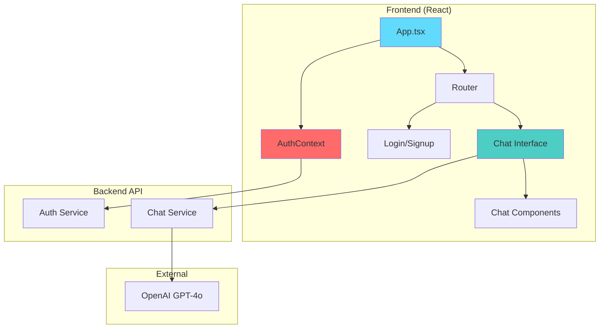
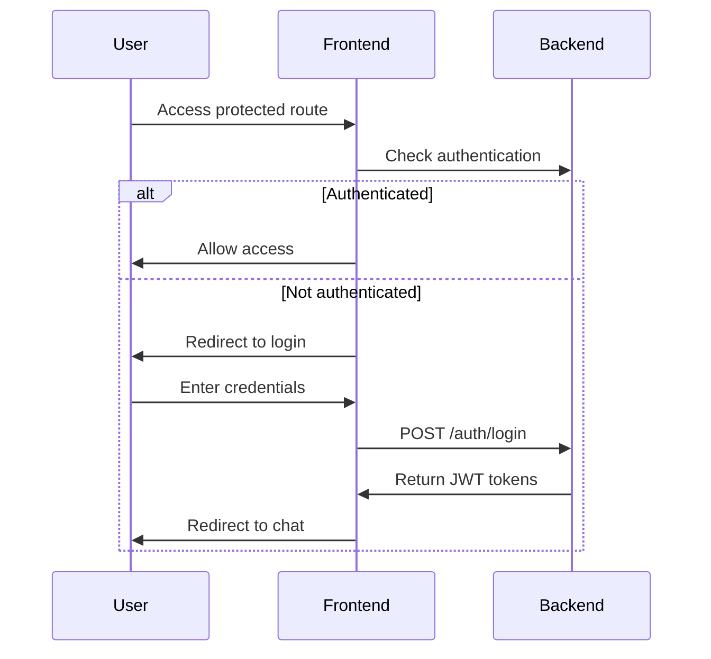

# TryIt - AI Chatbot with JWT Authentication

A modern React-based AI chatbot application with secure JWT token authentication and real-time chat capabilities.

## 🚀 Quick Start

### Prerequisites
- **Node.js** (v16+)
- **npm** or **yarn**
- **Backend API** with JWT authentication

### Setup
```bash
# Clone & install
git clone <repository-url>
cd tryitweb-main
npm install

# Environment setup
# Create .env file:
REACT_APP_API_LINK=http://localhost:3001/api
REACT_APP_API_KEY=your_api_key_here

# Start development
npm start
```

### Available Scripts
| Command | Description |
|---------|-------------|
| `npm start` | Development server |
| `npm test` | Run tests |
| `npm run build` | Production build |

## 🏗️ Architecture

### System Overview


### Authentication Flow


## 📱 Screenshots

### Authentication
<!-- Add screenshots here -->
- **Login Page**: Modern authentication interface
  
- **Signup Page**: User registration form
  

### Chat Interface
<!-- Add screenshots here -->
- **Main Chat**: Clean chat interface
  
- **Mobile View**: Responsive design
  
- **Theme Toggle**: Dark/light mode
  

<!-- Alternative: Centered layout -->
<div align="center">
  <h3>Application Screenshots</h3>
  
  
  
</div>

## 🔐 Features

### Authentication
- JWT access & refresh tokens
- Automatic token refresh
- Protected routes
- Session persistence

### Chat
- GPT-4o integration
- Real-time streaming
- Markdown support
- Message history

### UI/UX
- Responsive design
- Modern gradients
- Smooth animations
- Form validation

## 🛠️ Tech Stack

| Category | Technology |
|----------|------------|
| **Frontend** | React 18, TypeScript |
| **Routing** | React Router DOM |
| **Auth** | JWT, jwt-decode |
| **HTTP** | Axios |
| **Styling** | Tailwind CSS |
| **UI** | React Markdown |

## 📁 Project Structure
```
src/
├── components/
│   ├── auth/          # Login, Signup
│   ├── ChatHeader.tsx
│   ├── ChatInput.tsx
│   └── ChatMessage.tsx
├── contexts/          # Auth, Theme
├── hooks/            # useChat
├── utils/            # JWT utils
├── App.tsx           # Main app
└── TryIt.tsx         # Chat interface
```

## 🔌 API Endpoints

| Endpoint | Method | Description |
|----------|--------|-------------|
| `/auth/signup` | POST | User registration |
| `/auth/login` | POST | User login |
| `/auth/refresh` | POST | Token refresh |
| `/chat` | POST | Send messages |

### Example Login
```json
POST /auth/login
{
  "email": "user@example.com",
  "password": "password123"
}

Response:
{
  "accessToken": "jwt_token_here",
  "refreshToken": "refresh_token_here",
  "user": { "id": "user_id", "name": "John Doe" }
}
```

## 🔒 Security

- **Token Management**: Short-lived access tokens (15-60 min)
- **Auto Refresh**: Transparent token renewal
- **Secure Storage**: localStorage with validation
- **Route Protection**: Authentication guards
- **CSRF Protection**: Secure token transmission

## 🚀 Deployment

```bash
# Build for production
npm run build

# Deploy build folder to:
# - Netlify
# - Vercel  
# - AWS S3
# - Docker
```

### Environment Variables
```env
REACT_APP_API_LINK=https://your-api-domain.com/api
REACT_APP_API_KEY=your_production_api_key
```

## 🐛 Troubleshooting

| Issue | Solution |
|-------|----------|
| Token Expiration | Check backend token expiry |
| CORS Errors | Configure backend CORS |
| Network Errors | Verify API endpoints |
| Storage Issues | Check localStorage |

## 🤝 Contributing

1. Fork repository
2. Create feature branch
3. Make changes
4. Submit pull request

##📄 License

This project is licensed under the MIT License.

---

**Made with ❤️ using React and JWT Authentication**
